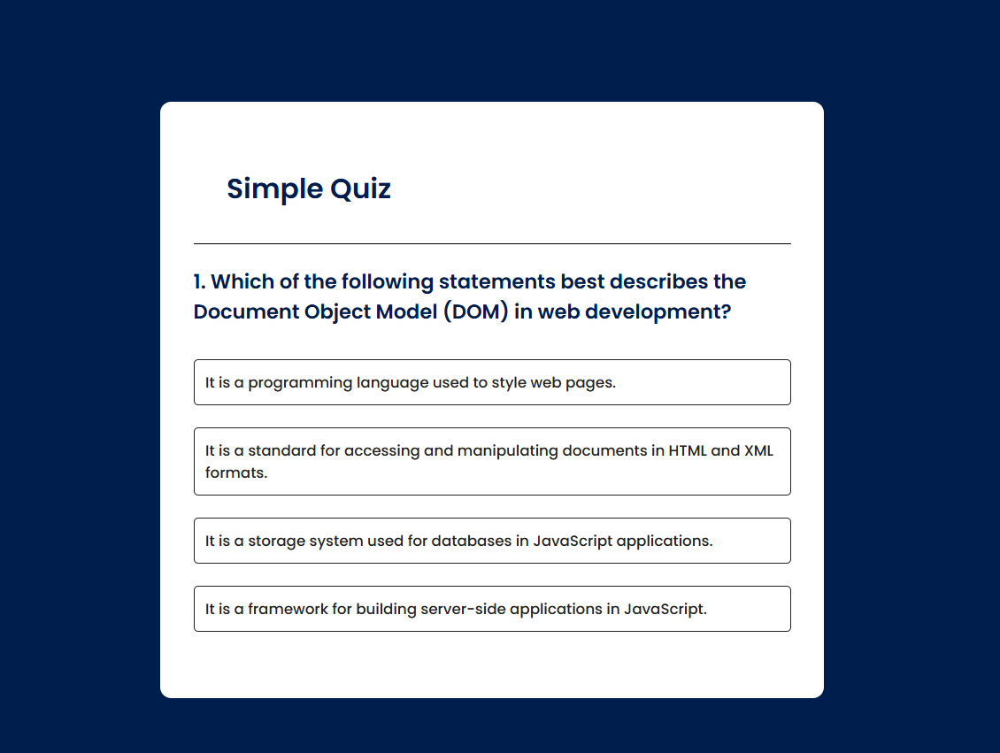

# Quiz App

A simple quiz app built with HTML, CSS, and JavaScript. This app displays multiple-choice questions, keeps track of the score, and provides instant feedback on correct and incorrect answers.

## Features

- Interactive UI with multiple-choice questions
- Immediate feedback on answer selection
- Score tracking and final score display at the end of the quiz
- Responsive design for both desktop and mobile devices

## Demo

You can view the live demo of the quiz app [here](URL) *(replace `URL` with the link to your hosted project, if applicable)*.

## Technologies Used

- **HTML** for the structure
- **CSS** for styling and responsiveness
- **JavaScript** for quiz logic and interactivity

## Screenshot

